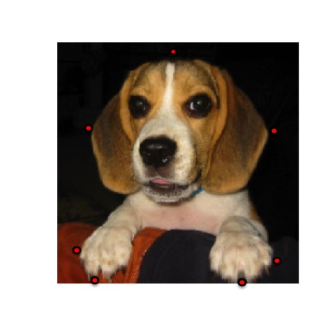
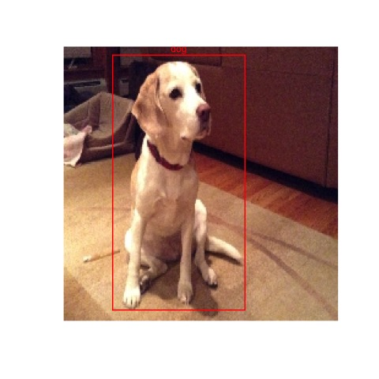

<!-- README.md is generated from README.Rmd. Please edit that file -->
boundingbox
===========

Select points on an image to generate a bounding box.

Installation
------------

**boundingbox** can be installed from Github.

### Github

``` r
library(devtools)
install_github("stomperusa/boundingbox")
```

Example
-------

The **boxer** function allows you to stream through images and select between 2 and 26 points around which a bounding box is generated.

``` r
box_coords <- boxer(names = c("dog_pic1.jpg", "dog_pic2.jpg"), file_path_input = "/dog_pics/input/", 
                    file_path_output = "/dog_pics/output/", classifier = "dog", show_classifier = T)
```

When an image appears, use the left mouse button to select a point, and the right mouse button to signal completion and to move to the next image. To skip through any of the images, use the right mouse button prior to selecting any points with the left button. If the selected point goes out of the bounds of the image, the x and/or y coordinate is adjusted to bring the point back into bounds. Specifically, it is adjusted to the nearest set of coordinates on the inside edge of the image.

Here is the first image with multiple points selected.



This is the output file generated with a bounding box based on the selected points. 

Here is the second streamed image with two points selected. 

This is the second output file generated with a bounding box based on the selected points. 

The resulting data frame will have the bounding box coordinates and the classifier for each of the images. Note that the y-axis starts in the upper left corner when working with images.

box\_coords

    #>      file_name x_left y_top x_right y_bottom classifier
    #> 1 dog_pic1.jpg     19     9     201      223        dog
    #> 2 dog_pic2.jpg     41     5     149      216        dog

If you have a large number of images to stream through, consider using the batch parameter which will prompt you to truncate the stream at the fixed interval you set. Otherwise if you are in the middle of the stream and do not want to continue you have two options. One is to right mouse click your way through each image until you skip through the remaining ones. You will then get the output of coordinates at the end. The other alternative is to force close the image viewer (for example, X Windows System) in which case the function will not complete and the coordinates for the generated bounding boxes will not be available.
